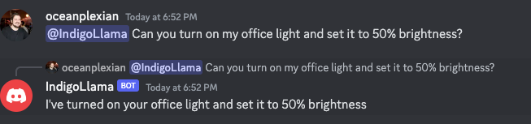

# Discord Bot with OpenAI-Compatible and Indigo Integration
## Overview

This is a Discord bot that integrates with an OpenAI-compatible llama.cpp server running a fine-tuned model called `MistralIndigoMerged-q4_0.gguf` and Indigo's home automation server. When mentioned in a Discord message, the bot can control Indigo devices or respond to queries using the fine-tuned model.


## Requirements

- Python 3.6 or higher
- Discord account and bot token
- Access to an Indigo home automation server with an API key
- An OpenAI-compatible llama.cpp server running the `MistralIndigoMerged-q4_0.gguf` model

## Installation

1. Clone the repository
   ```bash
   git clone <repo-url>
   cd <repo-directory>```

2. Install the required Python packages
  ```
  pip install llama-cpp-python
  ```

3. Launch the llama.cpp server
   ```
   python3 -m llama_cpp.server --model MistralIndigoMerged-q4_0.gguf --host 0.0.0.0 --n_gpu_layers 12
   ```

4. Run the bot
   ```
   OPENAI_API_KEY=your_openai_api_key_here DISCORD_TOKEN=your_discord_token_here REFLECTOR_NAME=your_reflector_name_here INDIGO_API_KEY=your_indigo_api_key_here python3 bot.py
   ```
